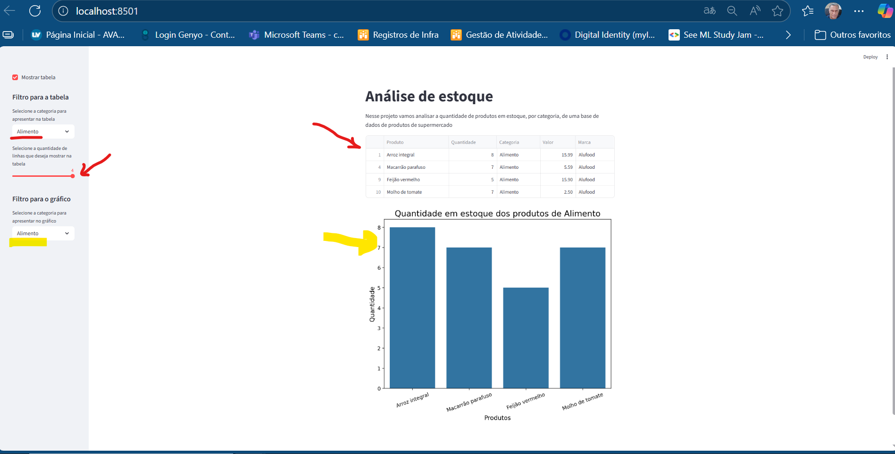
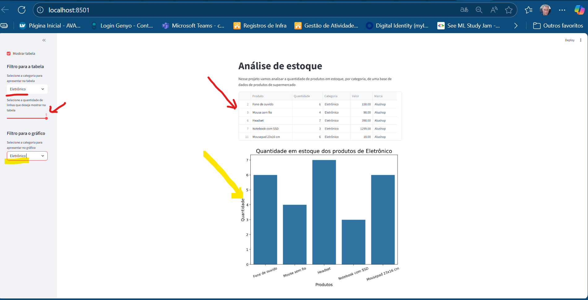
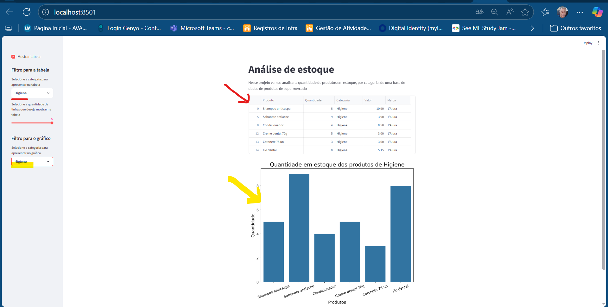
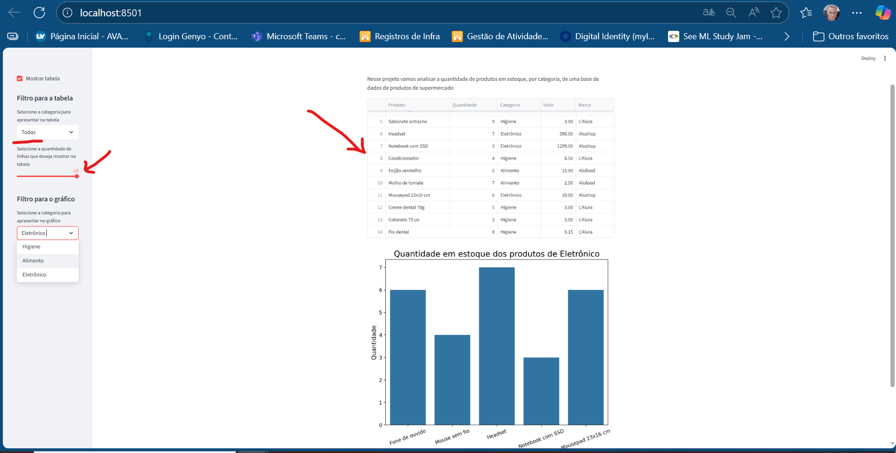

# Artigo_Streamlit
Projeto de Ciência de Dados criado para exercitar publicação de projetos com uso do Framework Streamlit.

# 📦 Dashboard Interativo de Análise de Estoque (Streamlit)


## 📝 Descrição do Projeto

Este projeto consiste em um dashboard interativo desenvolvido em Streamlit para análise exploratória de uma base de dados de estoque de produtos de supermercado. O objetivo é fornecer uma ferramenta visual rápida para gerentes e analistas acompanharem a quantidade de produtos em estoque, segmentada por categorias, permitindo uma tomada de decisão ágil sobre a reposição e gestão de inventário.

## 🛠️ Arquitetura e Tecnologia

O projeto segue uma arquitetura simples e eficiente, focada em Python e na rapidíssima prototipagem de dashboards:

* **Fonte de Dados:** Um arquivo CSV local (`estoque.csv`).
* **Lógica de Negócio e ETL:** Manipulação de dados e aplicação de filtros através do **Pandas**.
* **Visualização:** Criação dos gráficos de barras (Estoque por Produto) utilizando as bibliotecas **Matplotlib** e **Seaborn**.
* **Interface de Usuário (UI):** O **Streamlit** orquestra toda a aplicação, transformando o script Python em um aplicativo web interativo com barra lateral e widgets dinâmicos.

### Fluxo da Aplicação

1.  O **Streamlit** carrega o `estoque.csv` usando Pandas.
2.  O usuário interage com os filtros na **barra lateral (`st.sidebar`)** para selecionar a Categoria (para tabela e gráfico) e a quantidade de linhas a exibir.
3.  A cada alteração, o Streamlit reexecuta a lógica Python (`plot_estoque` ou `mostra_qntd_linhas`).
4.  Os resultados (tabela e gráfico) são atualizados em tempo real.

## 🔑 Resultados e Funcionalidades Chave

O dashboard oferece as seguintes funcionalidades principais:

1.  **Visão Geral de Dados:** Permite visualizar as primeiras `N` linhas do DataFrame de estoque, com formatação de valores (`R$ xx.xx`), controlado por um `slider` na barra lateral.
2.  **Filtragem de Tabela:** O usuário pode filtrar a exibição da tabela por qualquer `Categoria` presente no banco de dados.
3.  **Análise de Estoque por Categoria:** Apresentação de um **Gráfico de Barras** que detalha a `Quantidade` em estoque para cada `Produto`, restrito à `Categoria` selecionada na barra lateral.
4.  **Interface Intuitiva:** Separação clara entre a área de filtros (sidebar) e a área de visualização (main body).

## 🖼️ Prévia do Dashboard

Visualize a quantidade de estoque por categoria em tempo real:









## 🚀 Como Executar o Projeto Localmente

Para rodar este projeto na sua máquina, siga os passos abaixo:

### Pré-requisitos

Certifique-se de ter o Python 3.13+ e o `pip` instalados.

### 1. Clonar o Repositório

```bash
git clone [https://github.com/Ron-69/Artigo_Streamlit.git](https://github.com/Ron-69/Artigo_Streamlit.git)
cd NomeDoRepositorio
